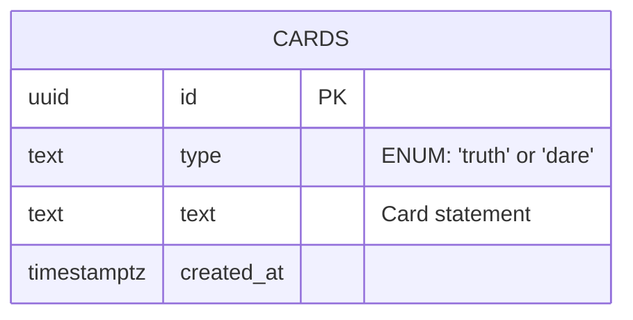

# “TAROT TRUTH & DARE”

Project Report submitted in partial fulfillment of the requirements for the award of the degree of

**BACHELOR OF COMPUTER APPLICATIONS (BCA)**

Submitted By

**NAME**: Manoharrish  
**ROLL NO**: [Enter Roll No]

Under the guidance of

**[Enter Faculty Name]**

SCHOOL OF COMPUTATIONAL AND PHYSICAL SCIENCES  
DEPARTMENT OF COMPUTER SCIENCE  
BCA/B.Sc PROGRAMME  
KRISTU JAYANTI [Deemed to be University]  
K. Narayanapura, Kothanur P.O., Bangalore – 560077

---

## DEPARTMENT OF COMPUTER SCIENCE 

### CERTIFICATE OF COMPLETION

This is to certify that the project entitled **“Tarot Truth & Dare”** has been satisfactorily completed by **[Enter Roll No], Manoharrish** in partial fulfillment of the award of the Bachelor of Computer Applications degree requirements prescribed by Kristu Jayanti [Deemed to be University] Bengaluru during the academic year 2025 -26.


Internal Guide &nbsp;&nbsp;&nbsp;&nbsp;&nbsp;&nbsp;&nbsp;&nbsp;&nbsp;&nbsp;&nbsp;&nbsp;&nbsp;&nbsp;&nbsp;&nbsp;&nbsp;&nbsp;&nbsp;&nbsp;&nbsp;&nbsp;&nbsp;&nbsp;&nbsp;&nbsp;&nbsp;&nbsp;&nbsp;&nbsp;&nbsp;&nbsp;&nbsp;&nbsp;&nbsp;&nbsp;&nbsp;&nbsp;&nbsp;&nbsp;&nbsp;&nbsp;&nbsp;&nbsp;&nbsp;&nbsp;&nbsp;&nbsp;&nbsp;&nbsp;&nbsp;&nbsp;&nbsp;&nbsp;&nbsp;&nbsp; Head of the Department

---

### DECLARATION

I, **[Enter Roll No], Manoharrish** hereby declare that the project work entitled **‘TAROT TRUTH & DARE’** is an original project work carried out by me, under the guidance of **[Enter Faculty Name]**


Signature: ___________________

Bengaluru Date: ______________

<div style="page-break-after: always;"></div>

## TABLE OF CONTENTS

| Sl. No | Topics | Pages |
| :--- | :--- | :--- |
| 1 | Introduction | 3 |
| 2 | Tools and Technologies used | 4 |
| 3 | Modern Web Development Workflow | 5 |
| 4 | System Architecture | 6 |
| 5 | Screenshots | 7 |
| 6 | Conclusion | 8 |
| 7 | References | 9 |

<div style="page-break-after: always;"></div>

## 1. Introduction

Tarot Truth & Dare reimagines the traditional party game into a refined, atmospheric digital experience. Instead of a basic random picker, this application presents a three-card tarot spread with animated reveal effects and a dark, ritual-inspired interface. The application supports large statement datasets stored in Supabase, ensuring randomized selection for each draw, and offers users an immersive choice between "Truth" (Moon Path) and "Dare" (Flame Path). It provides a highly interactive, cinematic experience using smooth animations, particle systems, and sound effects.

## 2. Tools and Technologies used

- **Frontend:** HTML5, CSS3 (3D Transforms, Custom Keyframe Animations, CSS Variables), JavaScript (ES6+ Vanilla).
- **Backend / Database:** Supabase (PostgreSQL) for remote database storage and RPC (Remote Procedure Call) integration.
- **External Libraries:** 
  - `@supabase/supabase-js` for database connectivity and queries.
  - `canvas-confetti` for visual celebratory effects.
- **Deployment & Hosting:** GitHub Pages for live application hosting.
- **Version Control:** Git and GitHub.

## 3. Modern Web Development Workflow

The development workflow of this application leverages modern web practices to ensure scalability and maintainability:
1. **Version Control:** The project codebase is versioned securely using Git and hosted on GitHub, allowing systematic tracking of changes and updates.
2. **Backend as a Service (BaaS):** Utilizing Supabase provides a fully managed PostgreSQL database. Background logic uses Supabase RPCs (like the `get_random_card` function invoking `ORDER BY random() LIMIT 1`) for efficient, randomized data retrieval to scale to thousands of cards.
3. **Frontend Architecture:** The user interface is strictly built using semantic HTML5 and vanilla CSS3 to maintain high performance without the overhead of heavy frameworks. The architecture uses CSS 3D transforms (`rotateY`) for performant hardware-accelerated animations like the card flips, and the HTML5 `<canvas>` element for the particle effects engine.
4. **Seamless Deployment:** The application relies on continuous deployment via GitHub Pages, enabling immediate hosting updates for the static assets (HTML, CSS, JS, audio).

## 4. System Architecture

### Entity-Relationship (ER) Diagram
The application utilizes a robust, optimized schema in Supabase for high-speed retrieval of statements.



### Application Flow Diagram
The flowchart depicts the interactive user journey, starting from the path selection to the randomized remote procedure call (RPC) database fetch and the final animated reveal.

```mermaid
flowchart TD
    A[Start Application] --> B[Initialize Ritual Theme]
    B --> C{User Selects Path}
    C -->|Moon Path| D[Truth Selected]
    C -->|Flame Path| E[Dare Selected]
    D --> F[Execute Supabase RPC:\n get_random_card('truth')]
    E --> G[Execute Supabase RPC:\n get_random_card('dare')]
    F --> H[Card Data Fetched]
    G --> H
    H --> I[Trigger CSS 3D Flip Animation]
    I --> J[Display Card with Statement]
    J --> K[Wait for Next Interaction]
    K --> C
```

## 5. Screenshots

*(Please insert your application screenshots here. Suggested screens to capture:)*
1. **The Path Selection Screen:** Showcasing the "Truth" and "Dare" selection interface.
2. **The Ritual Stage (Faced Down):** The three tarot cards waiting to be drawn.
3. **Action Revealed:** A card flipped over showing a fetched Truth or Dare statement.

## 6. Conclusion

The Tarot Truth & Dare application successfully reimagines a classic game into an interactive, modern web format. By combining a thematic, visually stunning UI with a robust Supabase backend capable of handling large datasets securely, it delivers a smooth and engaging user experience. The application's core logic efficiently ensures minimal repeats and quick retrieval. Future improvements, such as difficulty-based filtering, multiplayer syncing, and expanded admin dashboards, can build upon this strong foundation.

## 7. References

1. Supabase Documentation: https://supabase.com/docs
2. GitHub Pages Deployment Guide: https://docs.github.com/en/pages
3. MDN Web Docs - CSS 3D Transforms: https://developer.mozilla.org/en-US/docs/Web/CSS/transform-function/rotateY
4. MDN Web Docs - Canvas API: https://developer.mozilla.org/en-US/docs/Web/API/Canvas_API
